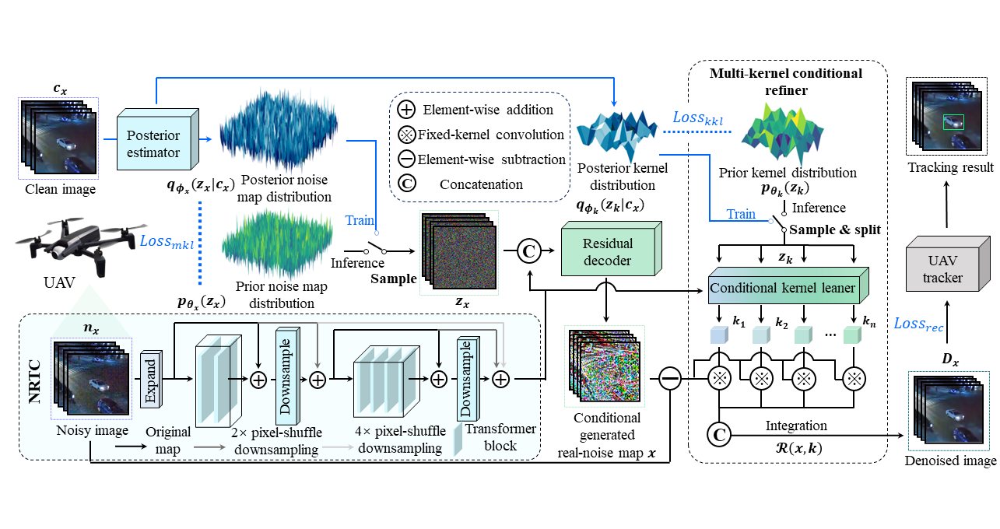

# [CGDenoiser]
# Conditional Generative Denoiser for Nighttime UAV Tracking

### Yucheng Wang, Changhong Fu, Kunhan Lu, Liangliang Yao, and Haobo Zuo

This is the official code for the paper "Conditional Generative Denoiser for Nighttime UAV Tracking".



# Abstract

State-of-the-art (SOTA) visual object tracking methods have greatly enhanced the autonomy of unmanned aerial vehicles (UAVs) in robotics applications. However, in low-light conditions, the presence of irregular real noise from the environments severely impacts the performance of these SOTA methods. Moreover, existing SOTA denoising techniques often fail to meet real-time processing requirements due to slow speeds. To design a more practical denoiser for UAV nighttime tracking, this work initiatively breaks free from traditional deterministic paradigm limitation and proposes a conditional generative denoiser (CGDenoiser), which instead generates the noise conditioning on the input and remove it. Specifically, a novel nested residual Transformer conditionalizer is developed to better align the dimension of inputs as well as quicken the rate of inference. Furthermore, an innovative multi-kernel conditional refiner is designed to pertinently refine the denoised output. Extensive experiments show that CGDenoiser promotes the tracking precision of the SOTA tracker by 18.18% on DarkTrack2021 whereas working 5.8 times faster than the second well-performed denoiser. Real-world tests with complex challenges also prove the effectiveness and practicality of CGDenoiser.


## Environment Preparing

```
python 3.7.3
pytorch 1.10.1
```

## Demo
### Demo Video
[](https://youtu.be/tuoebVKYEVg "CDT")


## Test


To test CGDenoiser, you should first prepare the test dataset (in our paper we evaluate the method on two authoritative benchmarks: [UAVDark135](https://vision4robotics.github.io/project/uavdark135/), [DarkTrack2021](https://darktrack2021.netlify.app/)), then you need to meet the environment requirements of base trackers and enhancers, as well as download their snapshots to corresponding folders at first. For a quick demo, this repo has included the snapshots of [SiamRPN++](https://github.com/STVIR/pysot?tab=readme-ov-file)(tracker) and [DCE++](https://github.com/Li-Chongyi/Zero-DCE_extension)(enhancer). Run the following example script for test:

```
python test.py                                    \
  --dataset UAVDark135                            \ # dataset_name
  --datasetpath ./test_dataset                    \ # dataset_path
  --trackername SiamRPN++                          \ # tracker_name

  --e_weights ./checkpoint/DCE/model.pth         \ # enhancer_model
  --enhancername DCE                              \ # enhancer_name

  --d_weights ./checkpoint/CGD/model.pth         \ # denoiser_model
  --denoisername CGD                                # denoiser_name

```


## Train

Before training, you need to prepare the training set of the [SIDD](https://www.eecs.yorku.ca/~kamel/sidd/index.php) dataset. Run the following script for training:

```
python -m torch.distributed.launch --nproc_per_node=1 --master_port=16888 train.py -opt config/CGD.yml --launcher pytorch
```


## Acknowledgements
- The code is implemented based on [SNOT](https://github.com/vision4robotics/SiameseTracking4UAV), [BasicSR](https://github.com/XPixelGroup/BasicSR), and [Restormer](https://github.com/swz30/Restormer). We would like to express our sincere thanks to the contributors.

- We would also like to thank [SiamMask](https://github.com/foolwood/SiamMask), [SiamCAR](https://github.com/ohhhyeahhh/SiamCAR), [SiamRPN++](), [SiamBAN](https://github.com/hqucv/siamban), and [SiamGAT](https://github.com/ohhhyeahhh/SiamGAT) trackers and [SCT](https://github.com/vision4robotics/SCT) and [DCE++](https://github.com/Li-Chongyi/Zero-DCE_extension) enhancers for their efforts.
